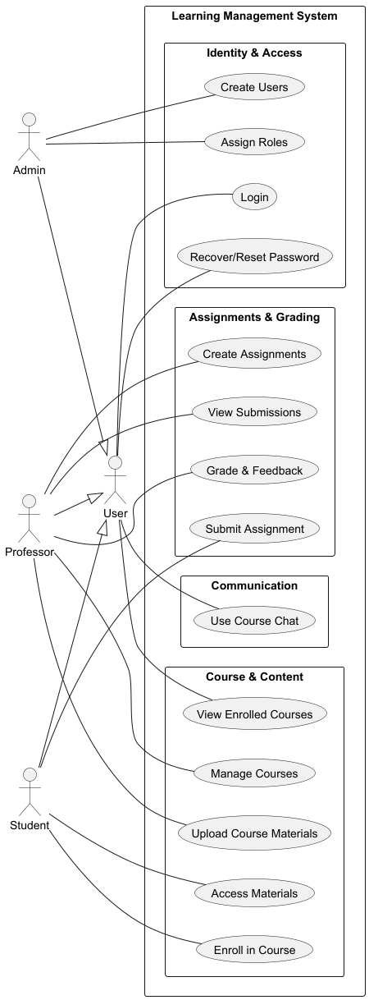

``# Phase 1 – Analysis / Requirements & Design

<!-- TOC -->
* [Phase 1 – Analysis / Requirements & Design](#phase-1--analysis--requirements--design)
  * [1. Project Description](#1-project-description)
  * [2. System Overview](#2-system-overview)
    * [2.1 Actors](#21-actors)
    * [2.2 Core Components](#22-core-components)
    * [2.3 Assets](#23-assets)
    * [2.4 System Boundary](#24-system-boundary)
  * [3. Functional Requirements](#3-functional-requirements)
    * [User Management](#user-management)
    * [Course Management](#course-management)
    * [Resource Management](#resource-management)
    * [Assignment Management](#assignment-management)
    * [Submission Management](#submission-management)
    * [Communication](#communication)
    * [Logging](#logging)
  * [4. Non-Functional Requirements](#4-non-functional-requirements)
  * [5. Use Case Diagram](#5-use-case-diagram)
  * [6. Security Requirements](#6-security-requirements)
    * [6.1 Authentication and Access Control (Threat-driven + ASVS V2/V4)](#61-authentication-and-access-control-threat-driven--asvs-v2v4)
    * [6.2 Data Security and Data Handling (Threat-driven + ASVS V8)](#62-data-security-and-data-handling-threat-driven--asvs-v8)
    * [6.3 Communication Security (ASVS V9)](#63-communication-security-asvs-v9)
    * [6.4 Input Validation and Request Integrity (ASVS V5)](#64-input-validation-and-request-integrity-asvs-v5)
    * [6.5 Third-Party Components (ASVS V14 + supply-chain best practice)](#65-third-party-components-asvs-v14--supply-chain-best-practice)
    * [6.6 Logging and Monitoring (ASVS V7)](#66-logging-and-monitoring-asvs-v7)
  * [7. Abuse Cases](#7-abuse-cases)
  * [8. General Design](#8-general-design)
  * [9. Domain Model](#9-domain-model)
    * [Main Aggregates (Aggregate Roots):](#main-aggregates-aggregate-roots)
    * [Supporting Entities (Internal to Aggregates):](#supporting-entities-internal-to-aggregates)
    * [Domain Model Diagram](#domain-model-diagram)
  * [10. Data Flow Diagrams](#10-data-flow-diagrams)
    * [10.1 DFD Level 0](#101-dfd-level-0)
    * [10.2 DFD Level 1](#102-dfd-level-1)
    * [10.3 DFD Level 2 - User Management](#103-dfd-level-2---user-management)
    * [10.3 DFD Level 2 - Course](#103-dfd-level-2---course)
    * [10.4 DFD Level 2 - Assignment](#104-dfd-level-2---assignment)
    * [10.3 DFD Level 2 - Chat](#103-dfd-level-2---chat)
    * [10.4 DFD Level 2 - File](#104-dfd-level-2---file)
  * [11. Threat Modeling](#11-threat-modeling)
    * [System-Wide Threat Modeling (Level 0)](#system-wide-threat-modeling-level-0)
    * [User Management Threat Modeling (Level 2)](#user-management-threat-modeling-level-2)
    * [Course and Assignment Management Threat Modeling (Level 2)](#course-and-assignment-management-threat-modeling-level-2)
  * [12. Risk Assessment](#12-risk-assessment)
    * [System-Wide Risk Assessment (Level 0)](#system-wide-risk-assessment-level-0)
    * [User Management Risk Assessment (Level 2)](#user-management-risk-assessment-level-2)
    * [Course and Assignment Management Risk Assessment](#course-and-assignment-management-risk-assessment)
  * [13. Mitigations](#13-mitigations)
    * [System-Wide Mitigations (Level 0)](#system-wide-mitigations-level-0)
    * [User Management Mitigations (Level 2)](#user-management-mitigations-level-2)
    * [Course and Assignment Management Mitigations](#course-and-assignment-management-mitigations)
  * [14. Secure Design Principles](#14-secure-design-principles)
  * [15. Secure Architecture](#15-secure-architecture)
  * [16. Security Test Planning](#16-security-test-planning)
    * [System-Wide Security Test Planning (Level 0)](#system-wide-security-test-planning-level-0)
    * [User Management Security Test Planning (Level 2)](#user-management-security-test-planning-level-2)
    * [Course and Assignment Management Security Test Planning](#course-and-assignment-management-security-test-planning)
    * [Chat Security Test Cases](#chat-security-test-cases)
* [File Security Test Cases](#file-security-test-cases)
  * [17. Traceability Matrix](#17-traceability-matrix)
    * [System-Wide Traceability Matrix (Level 0)](#system-wide-traceability-matrix-level-0)
    * [User Management Traceability Matrix (Level 2)](#user-management-traceability-matrix-level-2)
    * [Course and Assignment Management Traceability Matrix (Level 2)](#course-and-assignment-management-traceability-matrix-level-2)
<!-- TOC -->

## 1. Project Description

LearningMore is a secure academic platform designed to support course management, class materials distribution, assignment
submissions, and communication between students and professors.

The system is developed in the context of DESOFS and follows a Secure Software Development Lifecycle (SSDLC), focusing 
on secure design, threat modeling, and risk mitigation.

---

## 2. System Overview

### 2.1 Actors

* **Admin:** Manages user accounts, roles, and system status.
* **Professor:** Manages courses, uploads resources, creates assignments, and grades submissions.
* **Student:** Enrolls in courses, accesses materials, and submits assignments.
* **User:** General actor representing shared functionalities like Login and Chat.

### 2.2 Core Components

* **Service Layer (REST API):** Modular backend handling business logic and security.
* **Persistence Layer:** Relational database for structured data and metadata.
* **Storage Layer:** External file storage for academic resources and student uploads.

### 2.3 Assets

* **Identity:** User credentials (hashes) and session tokens.
* **Content:** Course materials (PDFs, videos) and descriptions.
* **Evaluation:** Student submissions, final grades, and professor feedback.
* **Interaction:** Real-time chat messages and logs.
* **Audit:** Authentication events and system activity logs.

### 2.4 System Boundary

The system boundary encompasses the backend API, the relational database, and the file storage system. All external 
entities (Admin, Professor, and Student) interact with the system exclusively through secure HTTP requests (REST API), 
which serves as the primary gateway for data exchange and functional execution.

---

## 3. Functional Requirements

### User Management

* FR1: The system shall allow an administrator to create and manage user accounts.
* FR2: The system shall allow an administrator to assign and modify user roles (Admin, Professor, Student).
* FR3: The system shall allow users to authenticate securely using their email and password.
* FR3.1: The system shall provide a mechanism for users to recover or reset their passwords.

### Course Management

* FR4: The system shall allow professors to create new courses with a unique code and title.
* FR5: The system shall allow professors to update course descriptions and information.
* FR6: The system shall allow students to enroll in available courses.
* FR7: The system shall allow users to view a dashboard with their active and enrolled courses.
* FR8: The system shall allow professors to organize and upload learning resources to their courses.

### Resource Management

* FR8: Professors can upload class materials
* FR9: Students can access course materials

### Assignment Management

* FR10: Professors can create assignments
* FR11: Assignments must have deadlines

### Submission Management

* FR12: Students can submit assignments
* FR13: Professors can view submissions
* FR14: Professors can grade submissions

### Communication

* FR15: Users can send messages in course chat
* FR16: Users can read course messages

### Logging

* FR17: System logs authentication events
* FR18: System logs critical actions

---

## 4. Non-Functional Requirements

* NFR1: The system must be implemented as a REST API
* NFR2: The system must use a relational database
* NFR3: The system must support concurrent users
* NFR4: The system must ensure data consistency
* NFR5: The system must support logging and monitoring
* NFR6: The system must be modular and maintainable
* NFR7: The system must support automated testing

---

## 5. Use Case Diagram

---

## 6. Security Requirements

Requirements are justified by threat model results (STRIDE), OWASP ASVS good practices, and academic-record protection 
obligations (confidentiality, integrity, accountability).

### 6.1 Authentication and Access Control (Threat-driven + ASVS V2/V4)

* SR1: Passwords must be stored using strong hashing algorithms.
* SR2: The system must enforce secure authentication mechanisms.
* SR3: The system must prevent brute force attacks.
* SR4: The system must enforce role-based access control (RBAC).
* SR5: Users must only access resources within their permissions.
* SR6: Access to course data must require enrollment validation.
* SR18: The system shall enforce an inactivity session timeout to automatically terminate sessions after a defined period of user inactivity
* SR19: The system shall enforce an absolute maximum session lifetime, after which users must re-authenticate regardless of activity.
* SR20: The system shall define a maximum number of concurrent active sessions per user account.  

Justification:

* Addresses spoofing and elevation-of-privilege threats (forged token, credential stuffing, role escalation, authorization bypass).

### 6.2 Data Security and Data Handling (Threat-driven + ASVS V8)

* SR7: Sensitive data must not be exposed in logs.
* SR8: File storage must be secured outside public directories.
* SR9: File access must be restricted based on authorization.

Justification:

* Addresses information-disclosure and tampering threats on grades, submissions, enrollment data, and stored files.

### 6.3 Communication Security (ASVS V9)

* SR13: All communication must be secured using HTTPS.
* SR14: Secure headers must be implemented.

Justification:

* Reduces token/session leakage and data exposure risks in transit.

### 6.4 Input Validation and Request Integrity (ASVS V5)

* SR10: All inputs must be validated server-side.
* SR11: File uploads must be validated (type, size, format).
* SR12: The system must prevent path traversal attacks.

Justification:

* Addresses SQL injection, malicious payload, and path/file manipulation risks.

### 6.5 Third-Party Components (ASVS V14 + supply-chain best practice)

* SR15: Third-party dependencies must be monitored for vulnerabilities.

Justification:

* Limits exploitability through known vulnerable libraries and transitive dependencies.

### 6.6 Logging and Monitoring (ASVS V7)

* SR16: The system must log security-relevant events.
* SR17: Logs must not contain sensitive information.

Justification:

* Provides non-repudiation and incident investigation capability while preserving confidentiality.

---

## 7. Abuse Cases

The following abuse cases identify potential scenarios where an attacker attempts to circumvent security controls across
all system levels (Level 0, 1, and 2):

* **AC1 Unauthorized access to submissions**: An actor attempts to view or modify assignments belonging to another
  student by manipulating resource identifiers.
* **AC2 Unauthorized file download**: Attempting to bypass authorization checks to download restricted course materials
  or exam solutions.
* **AC3 Brute force login**: Automated attempts to guess user credentials at the authentication gateway to gain
  unauthorized access.
* **AC4 Malicious file upload**: Uploading executable scripts or malware disguised as assignment submissions to
  compromise the server or other users.
* **AC5 Path traversal**: Attempting to access sensitive system files by manipulating file path parameters in download
  or upload requests.
* **AC6 Privilege escalation**: A student attempting to gain professor or administrator rights by manipulating
  role-based tokens or session metadata.
* **AC7 Access to solutions before release**: Exploiting logic flaws or timing attacks to view assignment solutions
  before the official release date.
* **AC8 Chat spam and injection**: Abuse of the communication channel to flood the system or inject malicious scripts
  such as XSS.
* **AC9 Unauthorized course access**: Attempting to join or view content of courses where the student is not officially
  enrolled.
* **AC10 Submission timestamp manipulation**: Tampering with client-side data or intercepting packets to submit
  assignments past the deadline.
* **AC11 Administrative session hijacking**: Capturing session identifiers via network sniffing on unencrypted channels
  to gain system control.
* **AC12 Bulk user data exfiltration**: Using injection techniques to extract the entire identity database through user
  management endpoints.

---

## 8. General Design

The system follows a layered architecture designed to enforce security at every level of the application stack, ensuring
defense-in-depth:

* API Layer (Controllers): Acts as the first line of defense where all incoming requests are authenticated,
  rate-limited, and validated against strict input schemas.
* Application Layer (Use Cases): Enforces business-specific authorization rules, ensuring that the authenticated actor
  has the required permissions to perform the requested action.
* Domain Layer (Business Logic): Contains core academic rules, such as enrollment validations and grade integrity
  checks, independent of external interfaces.
* Infrastructure Layer (Database and Storage): Provides secure data persistence with encryption at rest and isolated
  file storage accessible only via secure internal channels.

---

## 9. Domain Model

The domain model is organized into **Aggregates** to ensure data consistency and define clear boundaries between
different business contexts.

### Main Aggregates (Aggregate Roots):

* **User:** Manages identity, authentication, and system roles.
* **Course:** The central hub for academic content, organizing sessions and materials.
* **Assignment:** Manages the definition of tasks and the lifecycle of student work.
* **Chat:** Handles the real-time communication infrastructure.

### Supporting Entities (Internal to Aggregates):

* **Within Course:**
    * **Enrollment:** Records the link between a student and a course.
    * **ClassSession:** Defines specific scheduled lessons or topics.
    * **Resource:** Manages files and external links (PDFs, Videos, etc.).
* **Within Assignment:**
    * **Submission:** Represents the work delivered by a student, including grades and feedback.
* **Within Chat:**
    * **ChatMessage:** The individual messages sent within a specific ChatRoom.

### Domain Model Diagram

---

## 10. Data Flow Diagrams

### 10.1 DFD Level 0

### 10.2 DFD Level 1

### 10.3 DFD Level 2 - User Management

### 10.3 DFD Level 2 - Course

### 10.4 DFD Level 2 - Assignment

### 10.3 DFD Level 2 - Chat

### 10.4 DFD Level 2 - File

---

## 11. Threat Modeling

Threat modeling was performed using STRIDE for the Level 0, 1 and 2. In Phase 1, for the Level 2 DFDs, it was done for
the following modules:

* User Management
* Course Management
* Assignment Management
* Chat Management
* File Management

The detailed threat modeling reports, including the generated JSON files and threat descriptions, can be found in the
threat-model-reports folder.

### System-Wide Threat Modeling (Level 0)

At the architectural level (Level 0), the focus was on external boundaries and the flow between the User (Actor) and the
LearningMore System as a single entity.

Model artifacts:
* docs/diagrams/dfd-level-0-threat-dragon.json

* **Total threats identified:** 12 threats.
* **Primary focus:** Trust boundaries between the Public Internet and the System API.
* **Key findings:** * Identity Spoofing (due to the public-facing authentication endpoint).
  * Denial of Service (targeting the entire API availability).
  * Information Disclosure (leakage of metadata via HTTP headers).

### User Management Threat Modeling (Level 2)

Model artifacts:
* docs/diagrams/dfd-level-2-user-management-threat-dragon.json

Threat model scope decisions:

* Included: Identity lifecycle processes (registration, login, password recovery), session management, and
  administrative role assignment logic.
* Excluded from this phase: Chat message encryption and course-specific enrollment validation (covered in Course
  Management).

Threat inventory summary:

* **Total threats identified:** 11 threats.
* **Status:** 11 Open (Critical: 5, High: 3, Medium: 3).
* **Coverage:** Spoofing, Tampering, Information Disclosure, Elevation of Privilege, Repudiation.

Representative high-risk threats identified:

* **Spoofing:** Credential stuffing and automated brute force attacks targeting the central Login endpoint.
* **Elevation of Privilege:** Exploiting flaws in the role-assignment logic to escalate a Student account to
  Admin/Professor.
* **Tampering:** Unauthorized modification of sensitive user metadata or `UserRole` attributes in the database.
* **Information Disclosure:** User enumeration through predictable feedback in password reset or account creation flows.
* **Repudiation:** Administrative actions, such as user deletion or role changes, performed without secure and immutable
  audit logging.

### Course and Assignment Management Threat Modeling (Level 2)

Model artifacts:

* docs/diagrams/dfd-level-2-course-management.puml
* docs/diagrams/dfd-level-2-course-management-threat-dragon.json
* docs/diagrams/dfd-level-2-assignement-management.puml
* docs/diagrams/dfd-level-2-assignement-management-threat-dragon.json

Threat model scope decisions:

* Included: authentication/authorization paths, core processes, data stores, and security logging flows for course and assignment operations.
* Excluded from this phase: user management, chat, and file-management-only decomposition outside assignment submission handling.

Threat inventory summary:

* Assignment Management: 16 threats (High/Medium) covering Spoofing, Tampering, Repudiation, Information Disclosure, Denial of Service, Elevation of Privilege.
* Course Management: 18 threats (High/Medium) covering Spoofing, Tampering, Repudiation, Information Disclosure, Denial of Service, Elevation of Privilege.
* Total in scope: 34 threats.

Representative high-risk threats identified:

* Forged JWT/token bypasses access control (course and assignment).
* Authorization bypass / privilege escalation in enrollment and grading paths.
* Unauthorized read of grades, submissions, and restricted course data.
* Tampering with grades, deadlines, enrollment records, and audit trails.
* SQL injection against course query paths.
* DoS on enrollment, submission, and grading endpoints.

### Chat Management Threat Modeling (Level 2)

Model artifacts:
* docs/diagrams/dfd-level-2-chat-management-threat-dragon.json

Threat model scope decisions:

* Included: message creation, storage, retrieval, and user interaction flows within chat rooms.
* Included: authentication and authorization checks for chat access and message ownership.
* Excluded: end-to-end encryption (planned for future phases).

Threat inventory summary:

* Total threats identified: 9 threats.
* Coverage: Spoofing, Tampering, Information Disclosure, Denial of Service, Elevation of Privilege.

Representative high-risk threats identified:

* User impersonation in chat messages (spoofing identity).
* Unauthorized access to chat history (broken access control).
* Modification of stored messages affecting integrity.
* Message manipulation in transit between client and server.
* Chat flooding leading to denial of service.

### File Management Threat Modeling (Level 2)

Model artifacts:
* docs/diagrams/dfd-level-2-file-management-threat-dragon.json

Threat model scope decisions:

* Included: file upload, storage, retrieval, and metadata handling.
* Included: authorization checks for file ownership and course enrollment.
* Excluded: external CDN optimizations and caching layers.

Threat inventory summary:

* Total threats identified: 12 threats.
* Coverage: Spoofing, Tampering, Information Disclosure, Denial of Service, Elevation of Privilege.

Representative high-risk threats identified:

* Unauthorized file download via direct object reference.
* Malicious file upload (malware or executable payloads).
* Metadata manipulation affecting file ownership and permissions.
* Direct access to storage bypassing application logic.
* Large file uploads causing resource exhaustion.

---

## 12. Risk Assessment

Methodology used: Quantitative likelihood-impact scoring with explicit prioritization.

Scoring model:

* Likelihood (L): 1 to 5
* Impact (I): 1 to 5
* Risk Score = L x I (range 1 to 25)

Priority thresholds:

* Critical: 20-25
* High: 12-19
* Medium: 6-11
* Low: 1-5

Prioritization rule:

* First by risk score band, then by business impact on integrity/confidentiality of grades, submissions, and enrollment
  decisions.
* High and Critical risks are mandatory mitigation targets for this phase.

### System-Wide Risk Assessment (Level 0)

Methodology used: Quantitative likelihood-impact scoring focusing on global trust boundaries and data flows.
Likelihood (L) is derived from Threat Dragon scores, while Impact (I) is based on the technical severity of the threat.

| Risk ID | Threat                                            | L | I | Score | Priority | Justification                                                                                                |
|---------|---------------------------------------------------|--:|--:|------:|----------|--------------------------------------------------------------------------------------------------------------|
| R1      | Unauthorized Access via Broken Authentication     | 3 | 5 |    15 | High     | Critical flaw in central logic that allows session hijacking or login bypass to access private data.         |
| R2      | Administrative Credential Sniffing                | 3 | 5 |    15 | High     | Interception of admin credentials in transit, potentially granting full control over platform configuration. |
| R3      | System-Wide Denial of Service (DoS)               | 3 | 4 |    12 | High     | Traffic flooding that renders the service unavailable for all actors (Students, Professors, and Admins).     |
| R4      | Malicious File Injection / Upload and Execution   | 2 | 4 |     8 | Medium   | Risk of server infection or client-side malware distribution via corrupted course materials or assignments.  |
| R5      | Cross-Site Scripting (XSS) via Chat               | 2 | 3 |     6 | Medium   | Malicious scripts sent via chat that can steal session cookies and compromise user accounts in the browser.  |
| R6      | Unauthorized Access to Student Assignments (BOLA) | 2 | 3 |     6 | Medium   | Lack of explicit validation between Professor ID and Course ID, leading to student privacy breaches.         |

### User Management Risk Assessment (Level 2)

Methodology used: Quantitative likelihood-impact scoring focusing on the identity lifecycle and database integrity.
Likelihood (L) is derived from Threat Dragon scores, while Impact (I) is based on technical severity.

| Risk ID | Threat                                         | L | I | Score | Priority | Justification                                                                                              |
|---------|------------------------------------------------|--:|--:|------:|----------|------------------------------------------------------------------------------------------------------------|
| R1      | SQL Injection via User Management Inputs       | 3 | 5 |    15 | High     | Attackers can bypass security by injecting commands through Name/Email fields to modify database records.  |
| R2      | Unauthorized Access to Stored Credentials      | 3 | 5 |    15 | High     | Direct compromise of the User Database, exposing profile data and sensitive hashed passwords.              |
| R3      | Manipulation of Privilege Commands             | 3 | 5 |    15 | High     | Interception of role assignment requests to modify Privilege IDs and grant unauthorized high-level access. |
| R4      | Exposure of Password Hashes                    | 3 | 5 |    15 | High     | Internal interception of hashes during the flow between the database and the authentication process.       |
| R5      | Administrative Privilege Escalation            | 3 | 4 |    12 | High     | Exploitation of logic flaws in the Role Manager to grant "Super Admin" permissions to restricted users.    |
| R6      | Interception of Admin Credentials (Login flow) | 3 | 4 |    12 | High     | Capture of username/password packets in transit from the browser to the authentication service.            |
| R7      | Injection of Rogue Accounts                    | 2 | 4 |     8 | Medium   | Modification of "New User" data packets in transit to create accounts controlled by the attacker.          |
| R8      | Brute Force and Denial of Service              | 2 | 3 |     6 | Medium   | Automated login attempts causing resource exhaustion or locking out legitimate administrators.             |
| R9      | Lack of Modification Integrity (Repudiation)   | 2 | 3 |     6 | Medium   | Database changes made without auditing logs, preventing accountability for administrative actions.         |
| R10     | Unauthorized Profile Data Manipulation         | 2 | 3 |     6 | Medium   | Interception of update requests to modify sensitive profile fields like recovery emails or phone numbers.  |

### Course and Assignment Management Risk Assessment

Methodology used: Quantitative likelihood-impact scoring focusing on global trust boundaries and data flows.
Likelihood (L) is derived from Threat Dragon scores, while Impact (I) is based on the technical severity of the threat.

Top prioritized risks (course + assignment):

| Risk ID | Threat                                                          | L | I | Score | Priority | Justification                                                          |
|---------|-----------------------------------------------------------------|--:|--:|------:|----------|------------------------------------------------------------------------|
| R1      | Forged JWT/token bypasses access control                        | 4 | 5 |    20 | Critical | Enables unauthorized access to core academic operations across modules |
| R2      | Privilege escalation/authorization bypass (grading, enrollment) | 4 | 5 |    20 | Critical | Compromises grading and enrollment integrity directly                  |
| R3      | Unauthorized read of grades/submissions/course restricted data  | 4 | 5 |    20 | Critical | Direct confidentiality breach of academic records                      |
| R4      | Grade/deadline/enrollment tampering                             | 4 | 5 |    20 | Critical | Direct integrity violation with high institutional impact              |
| R5      | Audit trail tampering or missing evidence                       | 3 | 5 |    15 | High     | Breaks accountability and dispute resolution                           |
| R6      | SQL injection in course queries                                 | 3 | 5 |    15 | High     | Potential bulk data exfiltration/tampering                             |
| R7      | DoS on submission/enrollment/grading endpoints                  | 4 | 4 |    16 | High     | Directly impacts availability during critical deadlines                |
| R8      | Repudiation of enrollment/grading actions                       | 3 | 3 |     9 | Medium   | Lower immediate impact but affects legal/academic dispute handling     |

Risk acceptance criteria:

* No Critical risk can be accepted without compensating controls and documented owner sign-off.
* Medium risks may be accepted temporarily only with monitoring and planned mitigation milestone.

### Chat Management Risk Assessment (Level 2)

Methodology used: Quantitative likelihood-impact scoring focusing on communication security, message integrity, and access control in real-time chat interactions.

Top prioritized risks (chat module):

| Risk ID | Threat                                  | L | I | Score | Priority | Justification                                                                 |
|---------|------------------------------------------|--:|--:|------:|----------|------------------------------------------------------------------------------|
| R1      | Unauthorized chat room management        | 3 | 5 |    15 | High     | Students may gain control over chat rooms without proper permissions         |
| R2      | Unauthorized access to chat history      | 3 | 5 |    15 | High     | Exposure of sensitive communication between students and professors          |
| R3      | Modification of stored chat messages     | 3 | 5 |    15 | High     | Compromises integrity and trust of communication                             |
| R4      | Message alteration before storage        | 3 | 5 |    15 | High     | Malicious content injected before persistence                                |
| R5      | Interception of chat history data        | 3 | 5 |    15 | High     | Sensitive data exposure during transmission                                  |
| R6      | Message manipulation in transit          | 3 | 5 |    15 | High     | Attackers alter messages between client and server                           |
| R7      | Unauthorized access to chat history      | 3 | 5 |    15 | High     | Unauthorized users retrieving chat data                                      |
| R8      | User impersonation in chat messages      | 3 | 5 |    15 | High     | Attackers send messages as other users (spoofing)                            |
| R9      | Chat message flooding                   | 3 | 5 |    15 | High     | System overload and degradation of service availability                      |

Risk acceptance criteria:

* High risks require immediate mitigation.
* No risk in this module can be left without proper access control and validation mechanisms.

### File Management Risk Assessment (Level 2)

Methodology used: Quantitative likelihood-impact scoring focusing on file upload, storage, and secure access control.

Top prioritized risks (file module):

| Risk ID | Threat                              | L | I | Score | Priority | Justification                                                                 |
|---------|-------------------------------------|--:|--:|------:|----------|------------------------------------------------------------------------------|
| R1      | Forged authentication token         | 4 | 5 |    20 | Critical | Allows bypass of access control to protected files                           |
| R2      | Authorization bypass                | 4 | 5 |    20 | Critical | Users access files without proper enrollment or permissions                  |
| R3      | Unauthorized file download          | 4 | 5 |    20 | Critical | Exposure of restricted academic materials                                    |
| R4      | Direct file access                  | 4 | 5 |    20 | Critical | Bypass of application logic to access stored files                           |
| R5      | Malicious file upload               | 3 | 5 |    15 | High     | Upload of malware or harmful files affecting system/users                    |
| R6      | Unauthorized upload                 | 3 | 5 |    15 | High     | Students uploading content without permissions                               |
| R7      | Unauthorized metadata access        | 3 | 5 |    15 | High     | Exposure of sensitive file-related information                               |
| R8      | Metadata manipulation               | 3 | 5 |    15 | High     | Tampering with file ownership or permissions                                 |
| R9      | Metadata leakage                    | 3 | 5 |    15 | High     | Disclosure of internal paths or sensitive attributes                         |
| R10     | File modification                   | 3 | 5 |    15 | High     | Integrity compromise of stored files                                         |
| R11     | Large file upload attack            | 3 | 3 |     9 | Medium   | Resource exhaustion through large uploads                                    |
| R12     | Download flooding                   | 3 | 3 |     9 | Medium   | System overload via repeated download requests                               |

Risk acceptance criteria:

* Critical risks must be mitigated before deployment.
* High risks require immediate mitigation.
* Medium risks can be monitored with planned controls.

---

## 13. Mitigations

### System-Wide Mitigations (Level 0)

Mitigations for Level 0 focus on securing the external trust boundaries and ensuring the integrity of global data flows
between actors and the platform.

Priority mitigation plan:

| Risk ID | Key Mitigations                                                                                                                                       | Feasibility | Priority  |
|:--------|:------------------------------------------------------------------------------------------------------------------------------------------------------|:------------|:----------|
| R1      | Implementation of standard protocols (OAuth2/OpenID Connect), secure session management (high-entropy tokens), and MFA for critical accounts.         | High        | Immediate |
| R2      | Enforce mandatory TLS 1.3 for all endpoints, implement HSTS (HTTP Strict Transport Security), and use secure, HTTP-only cookies.                      | High        | Immediate |
| R3      | Deployment of DDoS protection (e.g., Cloudflare/AWS Shield), rate limiting per IP/User, and load balancing to ensure availability.                    | High        | Immediate |
| R4      | Integrated malware scanning for all uploads, strict file extension whitelisting, and isolated storage (e.g., S3 buckets with restricted permissions). | Medium      | Immediate |
| R5      | Rigorous input sanitization for chat messages, strong Content Security Policy (CSP), and output encoding to prevent script execution.                 | Medium-High | Immediate |
| R6      | Enforcement of Broken Object Level Authorization (BOLA) checks to validate the link between Professor ID, Course ID, and the requested Resource.      | Medium      | Immediate |

The implementation of global mitigations follows a "perimeter-first" approach to ensure the system's external boundaries
are secured before internal flows are refined:

1. **Network and Availability Hardening:** Deployment of DDoS protection (Cloudflare) and Rate Limiting (R3) to ensure
   the platform remains reachable.
2. **External Communication Security:** Enforcement of TLS 1.3 and HSTS (R2) to prevent credential sniffing at the
   gateway level.
3. **Core Authentication Gateway:** Integration of OAuth2/OpenID Connect (R1) as the primary entry point for all actors.
4. **Cross-Boundary Data Integrity:** Implementation of malware scanning for file uploads (R4) and sanitization for
   global chat flows (R5).
5. **Access Logic Refinement:** Deployment of BOLA checks (R6) to ensure cross-module data requests are authorized by
   context.

### User Management Mitigations (Level 2)

Focused on the identity lifecycle, protecting the user database, and ensuring the integrity of administrative privilege
commands.

Priority mitigation plan:

| Risk ID | Key Mitigations                                                                                                                           | Feasibility | Priority  |
|:--------|:------------------------------------------------------------------------------------------------------------------------------------------|:------------|:----------|
| R1      | Use of Parameterized Queries (Prepared Statements) for all database interactions and strict server-side validation for Name/Email fields. | High        | Immediate |
| R2      | Encryption of data at rest (AES-256) and password hashing using GPU-resistant algorithms such as Argon2 or BCrypt.                        | High        | Immediate |
| R3      | Request signing for administrative actions and use of secure tunnels (VPN/mTLS) for sensitive role-assignment commands.                   | Medium      | Immediate |
| R4      | Implementation of internal TLS/SSL encryption for the communication channel between the Application Server and the Database.              | Medium-High | Immediate |
| R5      | Strict implementation of Role-Based Access Control (RBAC) with "Least Privilege" validation for every profile management transaction.     | High        | Immediate |
| R6      | Enforcement of Secure and HTTP-Only flags on session cookies to prevent credential theft via sniffing or client-side scripts.             | High        | Immediate |
| R7      | Server-side integrity checks for "New User" packets and origin verification before processing account creation requests.                  | Medium      | Planned   |
| R8      | Progressive account lockout policies, CAPTCHA integration after successive failures, and real-time monitoring of brute-force patterns.    | High        | Immediate |
| R9      | Immutable database-level auditing and centralized application logs for all Create, Update, and Delete (CUD) operations.                   | Medium      | Planned   |
| R10     | HMAC-based integrity checks for profile update requests and ownership validation for sensitive recovery fields (email/phone).             | Medium      | Immediate |

The implementation for the User Management module is prioritized based on the protection of the identity store and the
integrity of administrative actions:

1. **Database and Persistence Security:** Implementation of Parameterized Queries (R1), data-at-rest encryption, and
   Argon2/BCrypt hashing (R2).
2. **Internal Flow Protection:** Encryption of the application-to-database channel (R4) and securing session cookies
   with HTTP-Only/Secure flags (R6).
3. **Identity Lifecycle Hardening:** Integration of lockout policies and CAPTCHA (R8) to protect the login process from
   brute-force attacks.
4. **Administrative Command Integrity:** Deployment of RBAC logic (R5) and HMAC/Signing for role-assignment and
   profile-update requests (R3, R10).
5. **Accountability and Auditability:** Activation of server-side integrity checks for new accounts (R7) and immutable
   audit logging for all administrative CUD operations (R9).

### Course and Assignment Management Mitigations

Mitigations are prioritized by risk score and focus first on Critical and High risks.

Priority mitigation plan:

| Risk ID | Key Mitigations                                                                                                        | Feasibility                | Priority  |
|---------|------------------------------------------------------------------------------------------------------------------------|----------------------------|-----------|
| R1      | JWT signature/issuer/audience/expiry validation, short token TTL, refresh rotation, revocation list                    | High (framework supported) | Immediate |
| R2      | Centralized authorization service, deny-by-default RBAC, ownership/enrollment checks per request, negative-path tests  | High                       | Immediate |
| R3      | Row-level authorization, response field filtering, secure object references, strict course-enrollment checks for reads | Medium-High                | Immediate |
| R4      | Server-side schema validation, immutable audit of grade/deadline/enrollment changes, optimistic locking/version checks | Medium                     | Immediate |
| R5      | Append-only audit log storage, signed/hash-chained entries, separated log access roles, off-system replication         | Medium                     | Immediate |
| R6      | Parameterized queries only, ORM safe patterns, input allowlists, SAST rules for injection sinks                        | High                       | Immediate |
| R7      | Endpoint rate limits, quota per actor/course, bounded worker pools, queue/backpressure, API circuit breakers           | High                       | Immediate |
| R8      | Actor-bound non-repudiation metadata (timestamp, IP, actor id), event correlation IDs, retention policy                | High                       | Planned   |

Implementation order:

1. Identity and authorization hardening (R1, R2)
2. Confidentiality and integrity protections (R3, R4, R6)
3. Observability and accountability controls (R5, R8)
4. Availability controls and resilience (R7)

### Chat Management Mitigations (Level 2)

Priority mitigation plan:

| Risk ID | Key Mitigations                                                                 | Feasibility | Priority  |
|---------|----------------------------------------------------------------------------------|-------------|-----------|
| R1      | RBAC enforcement on chat room actions, role validation per request              | High        | Immediate |
| R2      | Access control checks on message retrieval (enrollment + membership validation) | High        | Immediate |
| R3      | Immutable message storage or audit logging for message edits                    | Medium      | Immediate |
| R4      | TLS enforcement and message integrity validation                                | High        | Immediate |
| R5      | Input sanitization and output encoding (XSS prevention)                          | High        | Immediate |
| R6      | Rate limiting per user/chat room                                                | High        | Immediate |
| R7      | Anti-spam controls and message throttling                                       | Medium      | Planned   |

### File Management Mitigations (Level 2)

Priority mitigation plan:

| Risk ID | Key Mitigations                                                                                  | Feasibility | Priority  |
|---------|---------------------------------------------------------------------------------------------------|-------------|-----------|
| R1      | Strong JWT validation (issuer, audience, expiration)                                             | High        | Immediate |
| R2      | Strict authorization checks for file access (ownership + enrollment validation)                  | High        | Immediate |
| R3      | Indirect file access via API (no direct storage exposure)                                         | High        | Immediate |
| R4      | Signed URLs with expiration for secure file downloads                                             | Medium      | Immediate |
| R5      | File upload validation (type, size, MIME)                                                         | High        | Immediate |
| R6      | Malware scanning on upload                                                                       | Medium      | Immediate |
| R7      | Metadata integrity validation and access control                                                  | Medium      | Immediate |
| R8      | Rate limiting and quota on uploads/downloads                                                      | High        | Immediate |

---

## 14. Secure Design Principles

These principles are applied across all system levels (Level 0, 1, and 2) to ensure a defense-in-depth strategy:

* Enforce Server-side Authorization: Every request is validated at the API level (User, Course, and Assignment
  services), ensuring that client-side checks are never trusted.
* Validate All Inputs: Strict schema validation for all incoming data (JSON payloads, query parameters) to prevent
  injection attacks such as SQLi and XSS.
* Use Secure File Storage: All uploaded materials and assignments are stored in isolated buckets with no direct public
  access, using secure retrieval methods for authorized users.
* Apply Least Privilege Principle: Users including Students, Professors, and Admins are granted only the minimum
  permissions necessary for their specific roles.
* Deny Access by Default: Any request without a valid and authorized session or token is rejected by the gateway before
  reaching the internal services.

---

## 15. Secure Architecture

The architecture is designed to separate concerns between layers and enforce security at every trust boundary defined in
the DFDs:

* Controlled Access to Resources: Identity is managed by a dedicated User Management service at Level 2, which acts as
  the single source of truth for authentication and role verification.
* Secure Communication: All data flows between external actors and the system at Level 0, and between internal processes
  at Level 1, are encrypted using TLS 1.3.
* Isolation of Sensitive Components: The database is isolated from direct external access, reachable only by application
  services through secure internal channels to protect user and academic data.
* Trust Boundary Enforcement: Every transition between an external entity and a system process is protected by a
  mandatory authentication and authorization gate.

---

## 16. Security Test Planning

### System-Wide Security Test Planning (Level 0)

The security testing for Level 0 focuses on the platform's perimeter, public entry points, and the security of data in
transit across global trust boundaries.

**Abuse cases in scope for Phase 1 (Perimeter):**

* **AC11 Administrative session hijacking:** Attempting to capture and reuse admin session tokens via unencrypted or
  weak network channels.
* **AC14 Authentication service exhaustion:** Flooding the login and registration gateway to cause a system-wide denial
  of service (DoS).
* **AC16 Global path traversal:** Attempting to access unauthorized system files through public-facing data flows.

**Specific test types:**

* **Network Boundary Tests:** Verification of TLS 1.3 enforcement, HSTS header presence, and automatic redirection of
  plaintext HTTP.
* **Availability & Resilience Tests:** Validation of rate limiting per IP and global DDoS protection mechanisms under
  simulated flood.
* **Perimeter Integrity Tests:** Scanning for open ports and verifying that only authorized endpoints are exposed to
  external entities.

### User Management Security Test Planning (Level 2)

Testing for the User Management module is centered on the integrity of the identity lifecycle, the protection of
sensitive user data, and the prevention of privilege escalation.

**Abuse cases in scope for Phase 1 (Identity):**

* **AC12 Bulk user data exfiltration:** Using SQL injection techniques on Name/Email fields to dump the entire identity
  database.
* **AC13 Unauthorized privilege grant:** Attempting to modify role-assignment packets in transit to elevate a Student
  account to Admin status.
* **AC15 Account recovery takeover:** Tampering with profile update requests to redirect recovery emails to an
  attacker-controlled address.

**Specific test types:**

* **Identity Lifecycle Tests:** Validation of secure registration flows, verification of Argon2/BCrypt hashing strength,
  and profile update integrity.
* **Privilege Logic Tests:** Negative testing of role-assignment commands and RBAC enforcement on administrative API
  endpoints.
* **Credential Protection Tests:** Verification of "Secure" and "HttpOnly" flags on all session-related cookies and
  internal database connection strings.
* **Audit Trail Tests:** Ensuring that every Create, Update, or Delete (CUD) action on a user profile generates a
  non-repudiable log entry.

### Course and Assignment Management Security Test Planning

Security testing methodology:

* Threat-driven testing: each STRIDE threat mapped to one or more security tests.
* Abuse-case-driven validation: explicit negative scenarios for access control, data exposure, and tampering.
* ASVS-based architectural review: OWASP ASVS controls relevant to architecture and design are checked for in-scope modules.
* Regression gate: high-priority threat tests are mandatory in CI before merge.

Security test types:

* Authentication tests (token validation, invalid/expired token handling, brute-force protections)
* Authorization tests (RBAC, object ownership, enrollment checks, deny-by-default paths)
* Input validation tests (schema violations, injection payloads, boundary values)
* Data handling tests (unauthorized reads/writes, grade/deadline/enrollment integrity)
* Logging and monitoring tests (security event presence, sensitive data absence in logs)
* Availability tests (rate limits, throttling, graceful degradation under request floods)

Abuse cases in scope for Phase 1:

* AC1 Unauthorized access to submissions
* AC3 Brute force login
* AC4 Malicious file upload
* AC6 Privilege escalation
* AC9 Unauthorized course access
* AC10 Submission timestamp manipulation

Threat modeling review process:

1. Update DFDs for assignment and course after architecture change
2. Re-run STRIDE review over changed processes/flows/stores
3. Re-score risks using the same L x I model
4. Update mitigation status and test mapping
5. Require reviewer approval for any new High/Critical risk

ASVS architecture-focused coverage (planned checks):

* V1 Architecture, Design and Threat Modeling
* V2 Authentication
* V4 Access Control
* V5 Validation, Sanitization and Encoding
* V7 Error Handling and Logging
* V8 Data Protection
* V9 Communications
* V14 Configuration

Traceability standard:

* Every High/Critical threat must map to at least one security requirement and one executable security test case.

### Chat and File Management Security Test Planning

Security testing focuses on validating communication integrity, file handling security, and access control.

Test types:

- Authentication tests (token validation in chat/file endpoints)
- Authorization tests (chat membership, file ownership, course enrollment)
- Input validation tests (chat messages, file uploads)
- Data protection tests (unauthorized access to chat history and files)
- Availability tests (chat flooding, file upload/download abuse)

---

## Chat Security Test Cases

- **ST-C1:** Unauthorized user cannot access chat history
- **ST-C2:** Message impersonation attempt is rejected
- **ST-C3:** Chat message containing script injection is sanitized
- **ST-C4:** Chat flooding is rate-limited and blocked

---

## File Security Test Cases

- **ST-F1:** Unauthorized file download is blocked
- **ST-F2:** Malicious file upload is rejected
- **ST-F3:** Direct access to storage endpoint is denied
- **ST-F4:** File size limits prevent resource exhaustion
- **ST-F5:** Path traversal attempts are blocked

---

## 17. Traceability Matrix

### System-Wide Traceability Matrix (Level 0)

| Requirement                    | Threat(s) | Mitigation(s)                             | Security Test(s)                                  |
|:-------------------------------|:----------|:------------------------------------------|:--------------------------------------------------|
| SR1 Centralized Authentication | L0-R1     | OAuth2/OpenID Connect implementation      | ST-1 Bypass login screen attempt rejection        |
| SR2 Transport Layer Security   | L0-R2     | Mandatory TLS 1.3 and HSTS                | ST-2 Interception attempt on non-HTTPS traffic    |
| SR3 Global Rate Limiting       | L0-R3     | DDoS protection and IP-based throttling   | ST-3 Service availability under simulated flood   |
| SR4 Global File Integrity      | L0-R4     | Virus scanning and extension whitelisting | ST-4 Rejection of executable scripts in uploads   |
| SR5 Content Security Policy    | L0-R5     | Strong CSP and output encoding            | ST-5 Script injection in chat block validation    |
| SR6 BOLA Validation (Global)   | L0-R6     | Actor-to-resource ownership checks        | ST-6 Professor accessing non-assigned course data |

### User Management Traceability Matrix (Level 2)

| Requirement                   | Threat(s)  | Mitigation(s)                               | Security Test(s)                                       |
|:------------------------------|:-----------|:--------------------------------------------|:-------------------------------------------------------|
| SR1 SQL Injection Protection  | U-R1       | Parameterized queries (Prepared Statements) | ST-1 SQL payload injection in Name/Email fields        |
| SR2 Data-at-Rest Protection   | U-R2       | AES-256 encryption for user database        | ST-2 Validation of encrypted state in DB storage       |
| SR3 Secure Password Storage   | U-R2, U-R4 | Argon2 or BCrypt hashing                    | ST-3 Verification of high-entropy hash format          |
| SR4 Secure Admin Channel      | U-R3, U-R6 | mTLS or Signed requests for admin actions   | ST-4 Rejection of unsigned role-change commands        |
| SR5 Least Privilege RBAC      | U-R5       | Strict role-based access validation         | ST-5 Student account role-escalation attempt           |
| SR6 Internal Traffic Security | U-R4       | Internal TLS between App and DB             | ST-6 Sniffing internal DB traffic for cleartext hashes |
| SR7 Account Creation Guard    | U-R7       | Server-side validation of new user packets  | ST-7 Modification of 'UserRole' in registration packet |
| SR8 Brute Force Protection    | U-R8       | Progressive lockout and CAPTCHA             | ST-8 Automatic IP lockout after X failed logins        |
| SR9 Administrative Auditing   | U-R9       | Immutable logging for all CUD operations    | ST-9 Verification of audit trail for user deletion     |
| SR10 Profile Integrity        | U-R10      | HMAC/Integrity checks for profile updates   | ST-10 Tampering with recovery email in transit         |

### Course and Assignment Management Traceability Matrix (Level 2)

| Requirement                                         | Threat(s)                   | Mitigation(s)                                             | Security Test(s)                                                           |
|-----------------------------------------------------|-----------------------------|-----------------------------------------------------------|----------------------------------------------------------------------------|
| SR2 Secure authentication                           | A1, C1, C2, A12             | JWT hardening, lockout, MFA for privileged roles          | ST-01 invalid/forged token rejection; ST-02 credential stuffing lockout    |
| SR4 RBAC enforcement                                | A2, A13, C10, C11           | Centralized authorization with deny-by-default            | ST-03 student cannot execute professor-only actions                        |
| SR5 Permission-bound access                         | A4, A9, A14, C8             | Row-level checks, object ownership validation             | ST-04 unauthorized user cannot read grades/submissions/course private data |
| SR6 Enrollment validation for course data           | C8, C9, C10                 | Enrollment precondition checks for reads and writes       | ST-05 non-enrolled student denied restricted course operations             |
| SR7 No sensitive data in logs                       | A4, C15                     | Log redaction and structured logging policies             | ST-06 verify logs contain no sensitive payload fields                      |
| SR9 File/data access authorization                  | A9, A10, A15                | Authorized access policy plus integrity controls          | ST-07 unauthorized file read/write blocked                                 |
| SR10 Server-side input validation                   | A7, C3, C4, C5, C18         | Strict validation schemas and business-rule validation    | ST-08 invalid payloads rejected with safe errors                           |
| SR11 Upload validation                              | A3, A5, A10                 | File type/size checks, malware scanning, integrity checks | ST-09 malicious or oversized upload rejected                               |
| SR12 Path traversal prevention                      | A9                          | Canonical path controls, storage isolation                | ST-10 traversal payloads cannot escape storage root                        |
| SR13 HTTPS communication                            | A1, C1                      | TLS-only transport and strict redirect policies           | ST-11 plaintext HTTP denied in production profile                          |
| SR14 Secure headers                                 | C8, A14                     | Security headers and cache-control hardening              | ST-12 headers validated in all auth/data endpoints                         |
| SR15 Third-party dependency security                | C16                         | Dependency scanning and patch policy                      | ST-13 CI dependency vulnerability gate                                     |
| SR16 Security event logging                         | A6, A11, A16, C12, C13, C17 | Append-only audit logging and correlation IDs             | ST-14 all sensitive actions generate auditable events                      |
| SR17 No sensitive information in monitoring outputs | A4, C15                     | Redaction in logs/traces/alerts                           | ST-15 observability data reviewed for leakage                              |

Threat key:

* L0-R# = Level 0 Threat number from the System-Wide Risk Assessment table.
* U-R# = User Management (Level 2) Threat number from the User Risk Assessment table.
* A# = Assignment threat number from docs/diagrams/dfd-level-2-assignement-management-threat-dragon.json
* C# = Course threat number from docs/diagrams/dfd-level-2-course-management-threat-dragon.json

---
``
