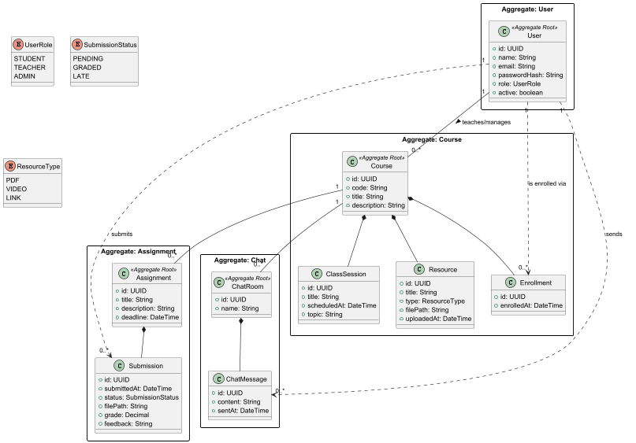
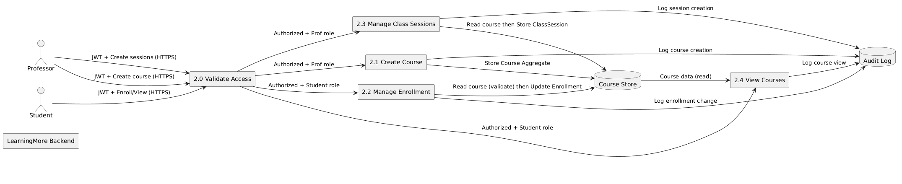
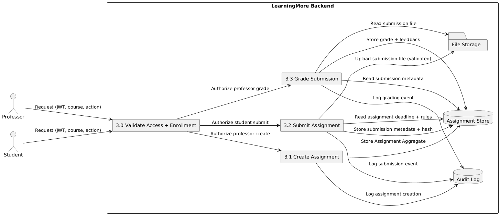

# Phase 1 – Analysis / Requirements & Design

## 1. Project Description

LearningMore is a secure academic platform designed to support course management, class materials distribution, assignment
submissions, and communication between students and professors.

The system is developed in the context of DESOFS and follows a Secure Software Development Lifecycle (SSDLC), focusing 
on secure design, threat modeling, and risk mitigation.

---

## 2. System Overview

### 2.1 Actors

* **Admin:** Manages user accounts, roles, and system status.
* **Professor:** Manages courses, uploads resources, creates assignments, and grades submissions.
* **Student:** Enrolls in courses, accesses materials, and submits assignments.
* **User:** General actor representing shared functionalities like Login and Chat.

### 2.2 Core Components

* **Service Layer (REST API):** Modular backend handling business logic and security.
* **Persistence Layer:** Relational database for structured data and metadata.
* **Storage Layer:** External file storage for academic resources and student uploads.

### 2.3 Assets

* **Identity:** User credentials (hashes) and session tokens.
* **Content:** Course materials (PDFs, videos) and descriptions.
* **Evaluation:** Student submissions, final grades, and professor feedback.
* **Interaction:** Real-time chat messages and logs.
* **Audit:** Authentication events and system activity logs.

### 2.4 System Boundary

The system boundary encompasses the backend API, the relational database, and the file storage system. All external 
entities (Admin, Professor, and Student) interact with the system exclusively through secure HTTP requests (REST API), 
which serves as the primary gateway for data exchange and functional execution.

---

## 3. Functional Requirements

### User Management

* FR1: The system shall allow an administrator to create and manage user accounts.
* FR2: The system shall allow an administrator to assign and modify user roles (Admin, Professor, Student).
* FR3: The system shall allow users to authenticate securely using their email and password.
* FR3.1: The system shall provide a mechanism for users to recover or reset their passwords.

### Course Management

* FR4: The system shall allow professors to create new courses with a unique code and title.
* FR5: The system shall allow professors to update course descriptions and information.
* FR6: The system shall allow students to enroll in available courses.
* FR7: The system shall allow users to view a dashboard with their active and enrolled courses.
* FR8: The system shall allow professors to organize and upload learning resources to their courses.

### Resource Management

* FR8: Professors can upload class materials
* FR9: Students can access course materials

### Assignment Management

* FR10: Professors can create assignments
* FR11: Assignments must have deadlines

### Submission Management

* FR12: Students can submit assignments
* FR13: Professors can view submissions
* FR14: Professors can grade submissions

### Communication

* FR15: Users can send messages in course chat
* FR16: Users can read course messages

### Logging

* FR17: System logs authentication events
* FR18: System logs critical actions

---

## 4. Non-Functional Requirements

* NFR1: The system must be implemented as a REST API
* NFR2: The system must use a relational database
* NFR3: The system must support concurrent users
* NFR4: The system must ensure data consistency
* NFR5: The system must support logging and monitoring
* NFR6: The system must be modular and maintainable
* NFR7: The system must support automated testing

---

## 5. Security Requirements

Requirements are justified by threat model results (STRIDE), OWASP ASVS good practices, and academic-record protection 
obligations (confidentiality, integrity, accountability).

### 5.1 Authentication and Access Control (Threat-driven + ASVS V2/V4)

* SR1: Passwords must be stored using strong hashing algorithms.
* SR2: The system must enforce secure authentication mechanisms.
* SR3: The system must prevent brute force attacks.
* SR4: The system must enforce role-based access control (RBAC).
* SR5: Users must only access resources within their permissions.
* SR6: Access to course data must require enrollment validation.

Justification:

* Addresses spoofing and elevation-of-privilege threats (forged token, credential stuffing, role escalation, authorization bypass).

### 5.2 Data Security and Data Handling (Threat-driven + ASVS V8)

* SR7: Sensitive data must not be exposed in logs.
* SR8: File storage must be secured outside public directories.
* SR9: File access must be restricted based on authorization.

Justification:

* Addresses information-disclosure and tampering threats on grades, submissions, enrollment data, and stored files.

### 5.3 Communication Security (ASVS V9)

* SR13: All communication must be secured using HTTPS.
* SR14: Secure headers must be implemented.

Justification:

* Reduces token/session leakage and data exposure risks in transit.

### 5.4 Input Validation and Request Integrity (ASVS V5)

* SR10: All inputs must be validated server-side.
* SR11: File uploads must be validated (type, size, format).
* SR12: The system must prevent path traversal attacks.

Justification:

* Addresses SQL injection, malicious payload, and path/file manipulation risks.

### 5.5 Third-Party Components (ASVS V14 + supply-chain best practice)

* SR15: Third-party dependencies must be monitored for vulnerabilities.

Justification:

* Limits exploitability through known vulnerable libraries and transitive dependencies.

### 5.6 Logging and Monitoring (ASVS V7)

* SR16: The system must log security-relevant events.
* SR17: Logs must not contain sensitive information.

Justification:

* Provides non-repudiation and incident investigation capability while preserving confidentiality.

---

## 6. Abuse Cases

* AC1: Unauthorized access to submissions
* AC2: Unauthorized file download
* AC3: Brute force login
* AC4: Malicious file upload
* AC5: Path traversal
* AC6: Privilege escalation
* AC7: Access to solutions before release
* AC8: Chat spam abuse
* AC9: Unauthorized course access
* AC10: Submission timestamp manipulation

---

## 7. General Design

The system follows a layered architecture:

* API layer (controllers)
* Application layer (use cases)
* Domain layer (business logic)
* Infrastructure layer (database, storage)

---

## 8. Domain Model

The domain model is organized into **Aggregates** to ensure data consistency and define clear boundaries between
different business contexts.

### Main Aggregates (Aggregate Roots):

* **User:** Manages identity, authentication, and system roles.
* **Course:** The central hub for academic content, organizing sessions and materials.
* **Assignment:** Manages the definition of tasks and the lifecycle of student work.
* **Chat:** Handles the real-time communication infrastructure.

### Supporting Entities (Internal to Aggregates):

* **Within Course:**
    * **Enrollment:** Records the link between a student and a course.
    * **ClassSession:** Defines specific scheduled lessons or topics.
    * **Resource:** Manages files and external links (PDFs, Videos, etc.).
* **Within Assignment:**
    * **Submission:** Represents the work delivered by a student, including grades and feedback.
* **Within Chat:**
    * **ChatMessage:** The individual messages sent within a specific ChatRoom.

### Domain Model Diagram

---

## 9. Data Flow Diagrams

### 9.1 DFD Level 0

### 9.2 DFD Level 1

### 9.3 DFD Level 2 - User Management

### 9.3 DFD Level 2 - Course

### 9.4 DFD Level 2 - Assignment

### 9.3 DFD Level 2 - Chat

### 9.4 DFD Level 2 - File

---

## 10. Threat Modeling

### Course and Assignment Management Threat Modeling

Threat modeling was performed using STRIDE over Level 2 DFDs for the two in-scope modules in Phase 1:

* Course Management
* Assignment Management

Model artifacts:

* docs/diagrams/dfd-level-2-course-management.puml
* docs/diagrams/dfd-level-2-course-management-threat-dragon.json
* docs/diagrams/dfd-level-2-assignement-management.puml
* docs/diagrams/dfd-level-2-assignement-management-threat-dragon.json

Threat model scope decisions:

* Included: authentication/authorization paths, core processes, data stores, and security logging flows for course and assignment operations.
* Excluded from this phase: user management, chat, and file-management-only decomposition outside assignment submission handling.

Threat inventory summary:

* Assignment Management: 16 threats (High/Medium) covering Spoofing, Tampering, Repudiation, Information Disclosure, Denial of Service, Elevation of Privilege.
* Course Management: 18 threats (High/Medium) covering Spoofing, Tampering, Repudiation, Information Disclosure, Denial of Service, Elevation of Privilege.
* Total in scope: 34 threats.

Representative high-risk threats identified:

* Forged JWT/token bypasses access control (course and assignment).
* Authorization bypass / privilege escalation in enrollment and grading paths.
* Unauthorized read of grades, submissions, and restricted course data.
* Tampering with grades, deadlines, enrollment records, and audit trails.
* SQL injection against course query paths.
* DoS on enrollment, submission, and grading endpoints.

---

## 11. Risk Assessment

### Course and Assignment Management Risk Assessment

Methodology used: Quantitative likelihood-impact scoring with explicit prioritization.

Scoring model:

* Likelihood (L): 1 to 5
* Impact (I): 1 to 5
* Risk Score = L x I (range 1 to 25)

Priority thresholds:

* Critical: 20-25
* High: 12-19
* Medium: 6-11
* Low: 1-5

Prioritization rule:

* First by risk score band, then by business impact on integrity/confidentiality of grades, submissions, and enrollment decisions.
* High and Critical risks are mandatory mitigation targets for this phase.

Top prioritized risks (course + assignment):

| Risk ID | Threat                                                          | L | I | Score | Priority | Justification                                                          |
|---------|-----------------------------------------------------------------|--:|--:|------:|----------|------------------------------------------------------------------------|
| R1      | Forged JWT/token bypasses access control                        | 4 | 5 |    20 | Critical | Enables unauthorized access to core academic operations across modules |
| R2      | Privilege escalation/authorization bypass (grading, enrollment) | 4 | 5 |    20 | Critical | Compromises grading and enrollment integrity directly                  |
| R3      | Unauthorized read of grades/submissions/course restricted data  | 4 | 5 |    20 | Critical | Direct confidentiality breach of academic records                      |
| R4      | Grade/deadline/enrollment tampering                             | 4 | 5 |    20 | Critical | Direct integrity violation with high institutional impact              |
| R5      | Audit trail tampering or missing evidence                       | 3 | 5 |    15 | High     | Breaks accountability and dispute resolution                           |
| R6      | SQL injection in course queries                                 | 3 | 5 |    15 | High     | Potential bulk data exfiltration/tampering                             |
| R7      | DoS on submission/enrollment/grading endpoints                  | 4 | 4 |    16 | High     | Directly impacts availability during critical deadlines                |
| R8      | Repudiation of enrollment/grading actions                       | 3 | 3 |     9 | Medium   | Lower immediate impact but affects legal/academic dispute handling     |

Risk acceptance criteria:

* No Critical risk can be accepted without compensating controls and documented owner sign-off.
* Medium risks may be accepted temporarily only with monitoring and planned mitigation milestone.

---

## 12. Mitigations

### Course and Assignment Management Mitigations

Mitigations are prioritized by risk score and focus first on Critical and High risks.

Priority mitigation plan:

| Risk ID | Key Mitigations                                                                                                        | Feasibility                | Priority  |
|---------|------------------------------------------------------------------------------------------------------------------------|----------------------------|-----------|
| R1      | JWT signature/issuer/audience/expiry validation, short token TTL, refresh rotation, revocation list                    | High (framework supported) | Immediate |
| R2      | Centralized authorization service, deny-by-default RBAC, ownership/enrollment checks per request, negative-path tests  | High                       | Immediate |
| R3      | Row-level authorization, response field filtering, secure object references, strict course-enrollment checks for reads | Medium-High                | Immediate |
| R4      | Server-side schema validation, immutable audit of grade/deadline/enrollment changes, optimistic locking/version checks | Medium                     | Immediate |
| R5      | Append-only audit log storage, signed/hash-chained entries, separated log access roles, off-system replication         | Medium                     | Immediate |
| R6      | Parameterized queries only, ORM safe patterns, input allowlists, SAST rules for injection sinks                        | High                       | Immediate |
| R7      | Endpoint rate limits, quota per actor/course, bounded worker pools, queue/backpressure, API circuit breakers           | High                       | Immediate |
| R8      | Actor-bound non-repudiation metadata (timestamp, IP, actor id), event correlation IDs, retention policy                | High                       | Planned   |

Implementation order:

1. Identity and authorization hardening (R1, R2)
2. Confidentiality and integrity protections (R3, R4, R6)
3. Observability and accountability controls (R5, R8)
4. Availability controls and resilience (R7)

---

## 13. Secure Design

* Enforce server-side authorization
* Validate all inputs
* Use secure file storage
* Apply least privilege principle
* Deny access by default

---

## 14. Secure Architecture

The architecture separates concerns between layers and enforces:

* controlled access to resources
* secure communication
* isolation of sensitive components

---

## 15. Security Test Planning

### Course and Assignment Management Security Test Planning

Security testing methodology:

* Threat-driven testing: each STRIDE threat mapped to one or more security tests.
* Abuse-case-driven validation: explicit negative scenarios for access control, data exposure, and tampering.
* ASVS-based architectural review: OWASP ASVS controls relevant to architecture and design are checked for in-scope modules.
* Regression gate: high-priority threat tests are mandatory in CI before merge.

Security test types:

* Authentication tests (token validation, invalid/expired token handling, brute-force protections)
* Authorization tests (RBAC, object ownership, enrollment checks, deny-by-default paths)
* Input validation tests (schema violations, injection payloads, boundary values)
* Data handling tests (unauthorized reads/writes, grade/deadline/enrollment integrity)
* Logging and monitoring tests (security event presence, sensitive data absence in logs)
* Availability tests (rate limits, throttling, graceful degradation under request floods)

Abuse cases in scope for Phase 1:

* AC1 Unauthorized access to submissions
* AC3 Brute force login
* AC4 Malicious file upload
* AC6 Privilege escalation
* AC9 Unauthorized course access
* AC10 Submission timestamp manipulation

Threat modeling review process:

1. Update DFDs for assignment and course after architecture change
2. Re-run STRIDE review over changed processes/flows/stores
3. Re-score risks using the same L x I model
4. Update mitigation status and test mapping
5. Require reviewer approval for any new High/Critical risk

ASVS architecture-focused coverage (planned checks):

* V1 Architecture, Design and Threat Modeling
* V2 Authentication
* V4 Access Control
* V5 Validation, Sanitization and Encoding
* V7 Error Handling and Logging
* V8 Data Protection
* V9 Communications
* V14 Configuration

Traceability standard:

* Every High/Critical threat must map to at least one security requirement and one executable security test case.

---

## 16. Traceability Matrix

Course + Assignment scoped traceability (extract):

| Requirement                                         | Threat(s)                   | Mitigation(s)                                             | Security Test(s)                                                           |
|-----------------------------------------------------|-----------------------------|-----------------------------------------------------------|----------------------------------------------------------------------------|
| SR2 Secure authentication                           | A1, C1, C2, A12             | JWT hardening, lockout, MFA for privileged roles          | ST-01 invalid/forged token rejection; ST-02 credential stuffing lockout    |
| SR4 RBAC enforcement                                | A2, A13, C10, C11           | Centralized authorization with deny-by-default            | ST-03 student cannot execute professor-only actions                        |
| SR5 Permission-bound access                         | A4, A9, A14, C8             | Row-level checks, object ownership validation             | ST-04 unauthorized user cannot read grades/submissions/course private data |
| SR6 Enrollment validation for course data           | C8, C9, C10                 | Enrollment precondition checks for reads and writes       | ST-05 non-enrolled student denied restricted course operations             |
| SR7 No sensitive data in logs                       | A4, C15                     | Log redaction and structured logging policies             | ST-06 verify logs contain no sensitive payload fields                      |
| SR9 File/data access authorization                  | A9, A10, A15                | Authorized access policy plus integrity controls          | ST-07 unauthorized file read/write blocked                                 |
| SR10 Server-side input validation                   | A7, C3, C4, C5, C18         | Strict validation schemas and business-rule validation    | ST-08 invalid payloads rejected with safe errors                           |
| SR11 Upload validation                              | A3, A5, A10                 | File type/size checks, malware scanning, integrity checks | ST-09 malicious or oversized upload rejected                               |
| SR12 Path traversal prevention                      | A9                          | Canonical path controls, storage isolation                | ST-10 traversal payloads cannot escape storage root                        |
| SR13 HTTPS communication                            | A1, C1                      | TLS-only transport and strict redirect policies           | ST-11 plaintext HTTP denied in production profile                          |
| SR14 Secure headers                                 | C8, A14                     | Security headers and cache-control hardening              | ST-12 headers validated in all auth/data endpoints                         |
| SR15 Third-party dependency security                | C16                         | Dependency scanning and patch policy                      | ST-13 CI dependency vulnerability gate                                     |
| SR16 Security event logging                         | A6, A11, A16, C12, C13, C17 | Append-only audit logging and correlation IDs             | ST-14 all sensitive actions generate auditable events                      |
| SR17 No sensitive information in monitoring outputs | A4, C15                     | Redaction in logs/traces/alerts                           | ST-15 observability data reviewed for leakage                              |

Threat key:

* A# = Assignment threat number from docs/diagrams/dfd-level-2-assignement-management-threat-dragon.json
* C# = Course threat number from docs/diagrams/dfd-level-2-course-management-threat-dragon.json

---