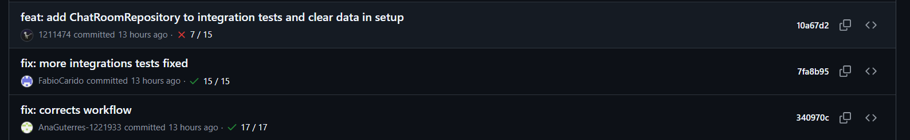
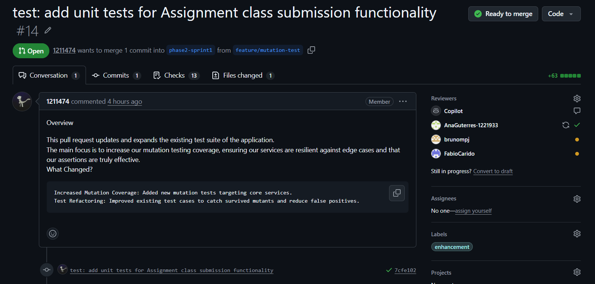
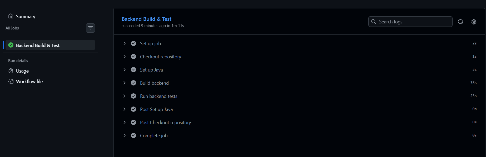
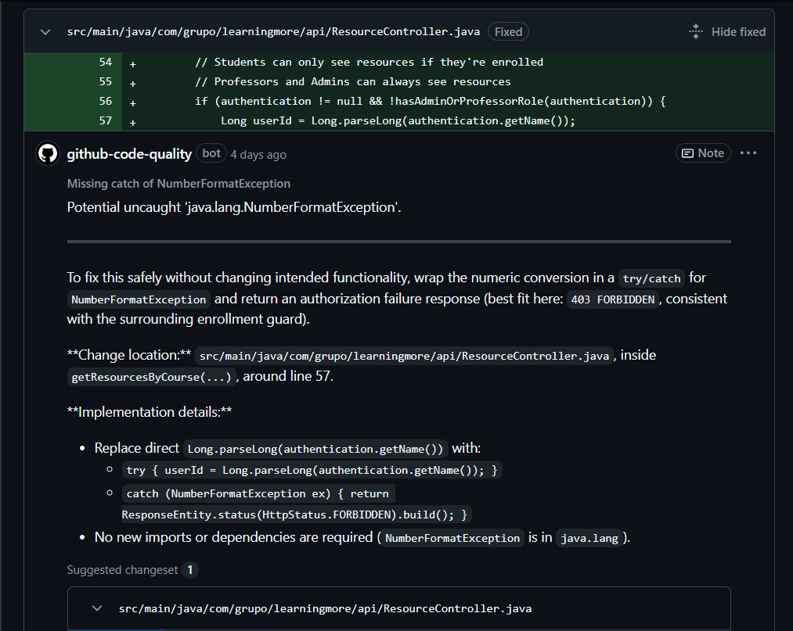
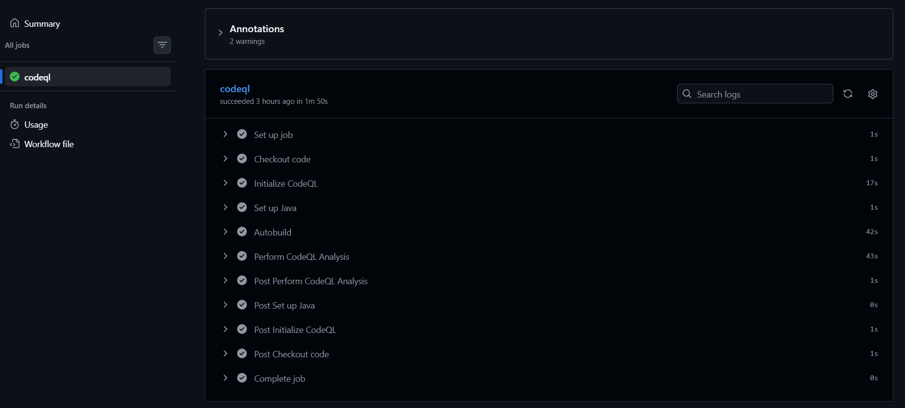
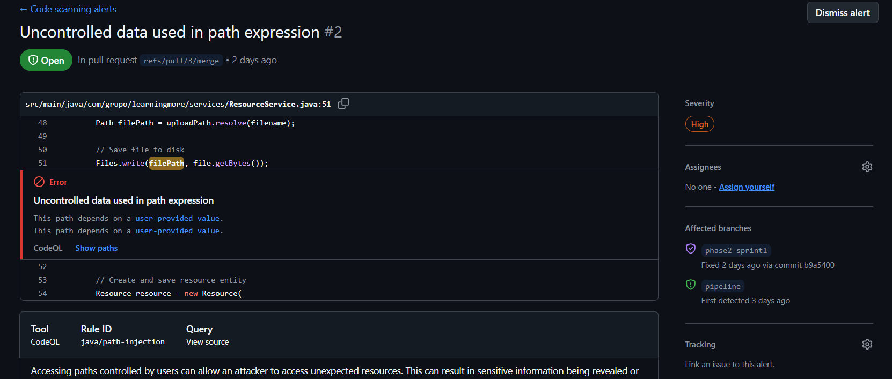
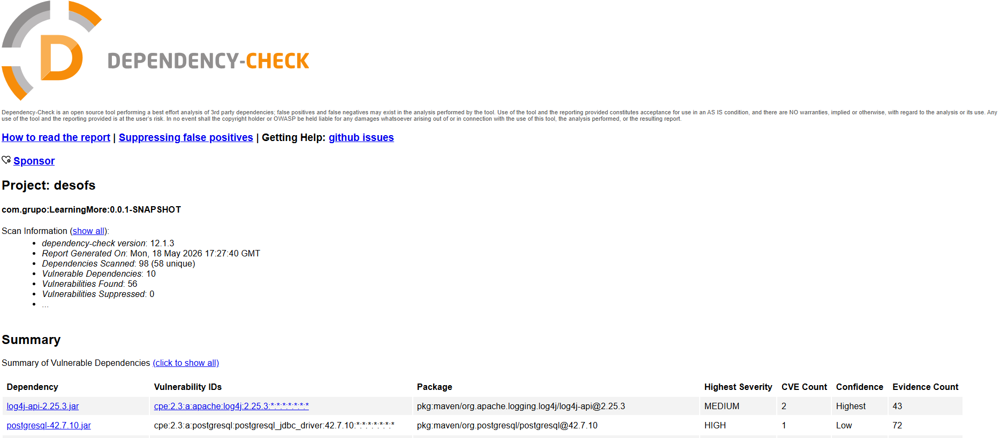
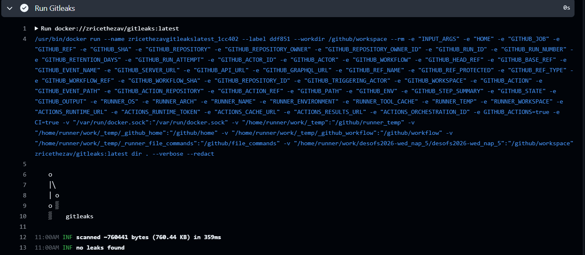
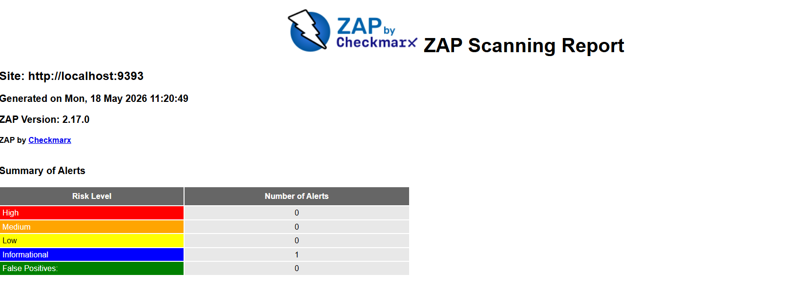
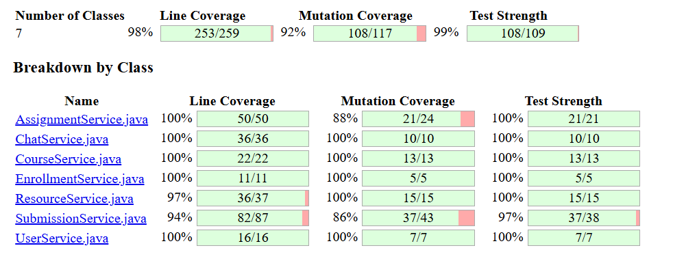

# Phase 2 – Sprint 1: Development & Testing

<!-- TOC -->
* [Phase 2 – Sprint 1: Development & Testing](#phase-2--sprint-1-development--testing)
  * [1. Overview](#1-overview)
  * [2. Development Practices](#2-development-practices)
    * [2.1 Commit Messages](#21-commit-messages)
    * [2.2 Pull Requests](#22-pull-requests)
    * [2.3 Code Reviews](#23-code-reviews)
    * [2.4 Branches](#24-branches)
  * [3. CI/CD Pipeline](#3-cicd-pipeline)
    * [3.1 Pipeline Overview](#31-pipeline-overview)
    * [3.2 CI Pipeline (Build & Test)](#32-ci-pipeline-build--test)
      * [Workflow Implementation](#workflow-implementation)
    * [3.3 Code Quality Workflow](#33-code-quality-workflow)
      * [Workflow Implementation](#workflow-implementation-1)
    * [3.4 Static Application Security Testing (SAST)](#34-static-application-security-testing-sast)
      * [Workflow Implementation](#workflow-implementation-2)
    * [3.5 Software Composition Analysis (SCA)](#35-software-composition-analysis-sca)
      * [Workflow Implementation](#workflow-implementation-3)
    * [3.6 Secret Detection](#36-secret-detection)
      * [Workflow Implementation](#workflow-implementation-4)
    * [3.7 Dynamic Application Security Testing (DAST)](#37-dynamic-application-security-testing-dast)
      * [Workflow Implementation](#workflow-implementation-5)
    * [3.8 PIT Mutation Testing](#38-pit-mutation-testing)
      * [Workflow Implementation](#workflow-implementation-6)
    * [3.9 Release Workflow](#39-release-workflow)
      * [Workflow Implementation](#workflow-implementation-7)
  * [4. Security Testing](#4-security-testing)
    * [4.1 Testing Strategy](#41-testing-strategy)
    * [4.2 Security Test Cases](#42-security-test-cases)
  * [5. Conclusion](#5-conclusion)
<!-- TOC -->

---

## 1. Overview

This phase focuses on the integration of secure development and DevSecOps practices into the project lifecycle.

This document presents the development conventions and security practices adopted during the implementation process, as
well as the CI/CD workflows created to support automated validation and secure software delivery.

A shift-left security approach was followed, integrating automated testing and security verification mechanisms 
throughout the development lifecycle.

---

## 2. Development Practices

To ensure consistent code quality and smooth collaboration within the team, a set of development conventions and
processes was defined. These include standards for commit messages, pull request management, code review practices, and
branch organization.

Following these guidelines helps maintain a clean and maintainable codebase, while also improving traceability and ease
of navigation throughout the project.

### 2.1 Commit Messages

The team adopts the Conventional Commits specification to ensure a clear, structured, and consistent commit history
throughout the project. Each commit message follows a standard format that improves readability and helps track the
purpose of changes more effectively.

The general structure used is: '**type**': '**description**'

Where '**description**' should give and explanation of what was done and '**type**' defines the nature of the change:

* **docs**: updates or additions to documentation
* **feat**: introduction of a new feature or functionality
* **fix**: correction of a bug or issue
* **test**: addition or modification of tests
* **chore**: maintenance tasks, dependency updates, and other routine work
* **refactor**: code changes that improve structure without altering behaviour



### 2.2 Pull Requests

Before any changes are merged into the `main` branch, a pull request must be created to ensure proper review and
validation of the implemented work.

**Title:**
Each pull request should have a clear and descriptive title summarizing the changes introduced.

**Description:**
If needed, a description can be provided, including:

* A summary of the changes made
* Any relevant details that help reviewers understand the modifications

**Assignment:**
Pull requests are typically assigned to the developer or developers responsible for the changes, ensuring 
traceability.

**Reviewers:**
Team members are added as reviewers to validate the changes before merging. Automated tools and pipelines may be used 
to support the review process when appropriate.

**Labels:**
When needed labels (e.g., bug, enhancement, documentation) can be used to help organize and categorize pull requests,
depending on their importance.



### 2.3 Code Reviews

Code reviews were used as part of the development workflow to support code quality and encourage knowledge sharing
within the team, although the level of formality varied depending on the task and context.

**Review approach:**
Pull requests were generally reviewed by at least one other team member before being merged, when possible. Feedback and
discussion were used to refine implementations and address potential issues.

**Reviewer focus:**
During review, attention was typically given to aspects such as:

* General correctness of the implementation
* Alignment with the expected functionality
* Results from automated checks and CI/CD pipelines (e.g., workflows, tests, and other validation steps)

**Automated support:**
In some cases, automated tools were used to assist with the review process by providing suggestions and highlighting 
potential issues. These tools were used as a complement to manual review rather than a strict requirement.

**Merge process:**
Once feedback was addressed and the changes were considered appropriate, the pull request could be merged into the main
branch by the author or another team member, depending on the situation.

### 2.4 Branches

During the development of this sprint, several branches were created according to the needs of the project, following a
simple and flexible branching strategy:

* **phase2-sprint1**: used as the main development branch for this sprint. Most of the work was integrated here before
  being merged into `main` at the end of the sprint
* **feature/...**: branches created from the sprint branch to implement specific features or tasks in isolation
* **main**: the main branch of the project, where stable and reviewed code is integrated after completion

---

## 3. CI/CD Pipeline

### 3.1 Pipeline Overview

The CI/CD system is implemented using multiple GitHub Actions workflows, triggered by different events such as push,
pull request, and manual execution.

Instead of a single pipeline, the system is composed of independent workflows that handle build, quality, testing,
security, and release operations.


### 3.2 CI Pipeline (Build & Test)

This workflow is responsible for building the application and running unit tests to validate basic functionality.

It is triggered on push and pull request events.

#### Workflow Implementation

```yaml
name: CI Pipeline

on:
  push:
  pull_request:

jobs:
  backend:
    name: Backend Build & Test
    runs-on: ubuntu-latest

    steps:
      - name: Checkout repository
        uses: actions/checkout@v5

      - name: Set up Java
        uses: actions/setup-java@v5
        with:
          distribution: temurin
          java-version: '17'
          cache: maven

      - name: Build backend
        run: mvn clean install

      - name: Run backend tests
        run: mvn test
````




### 3.3 Code Quality Workflow

This workflow ensures code consistency and detects potential issues in the codebase.

It is triggered on push, pull request, and manual execution.

#### Workflow Implementation

```yaml
name: Code Quality Analysis

on:
  push:
  pull_request:
  workflow_dispatch:

jobs:
  quality:
    runs-on: ubuntu-latest

    steps:
      - name: Checkout code
        uses: actions/checkout@v5

      - name: Set up Java
        uses: actions/setup-java@v4
        with:
          distribution: temurin
          java-version: '17'

      - name: Run Maven Checkstyle
        run: mvn checkstyle:check

      - name: Run SpotBugs
        run: mvn spotbugs:check
```




### 3.4 Static Application Security Testing (SAST)

SAST is implemented using GitHub CodeQL to detect security vulnerabilities in the source code.

It runs on push, pull request, and manual execution.

#### Workflow Implementation

```yaml
name: Static Application Security Testing (SAST)

on:
  push:
  pull_request:
  workflow_dispatch:

permissions:
  contents: read
  security-events: write

jobs:
  codeql:
    runs-on: ubuntu-latest

    steps:
      - name: Checkout code
        uses: actions/checkout@v5

      - name: Initialize CodeQL
        uses: github/codeql-action/init@v3
        with:
          languages: java

      - name: Set up Java
        uses: actions/setup-java@v4
        with:
          distribution: temurin
          java-version: '17'

      - name: Autobuild
        uses: github/codeql-action/autobuild@v3

      - name: Perform CodeQL Analysis
        uses: github/codeql-action/analyze@v3
```





### 3.5 Software Composition Analysis (SCA)

This workflow scans project dependencies for known vulnerabilities using OWASP Dependency Check.

It runs on push and pull request events.

#### Workflow Implementation

```yaml
name: SCA - OWASP Dependency Check

on:
  push:
  pull_request:

jobs:
  sca:
    runs-on: ubuntu-latest

    steps:
      - uses: actions/checkout@v4

      - name: Set up Java
        uses: actions/setup-java@v4
        with:
          distribution: temurin
          java-version: '17'
          cache: maven

      - name: Create OWASP cache directory
        run: mkdir -p ~/.dependency-check

      - name: Cache OWASP Dependency Check data
        uses: actions/cache@v4
        with:
          path: ~/.dependency-check
          key: owasp-db-${{ runner.os }}
          restore-keys: |
            owasp-db-

      - name: Run OWASP Dependency Check (Maven)
        run: |
          mvn -B org.owasp:dependency-check-maven:check \
            -DnvdApiKey=${{ secrets.NVD_API_KEY }} \
            -DossindexAnalyzerEnabled=false \
            -DdataDirectory=~/.dependency-check

      - name: Upload report
        if: always()
        uses: actions/upload-artifact@v4
        with:
          name: dependency-check-report
          path: target/dependency-check-report.*
```




### 3.6 Secret Detection

This workflow detects secrets in the repository using Gitleaks.

It runs on push, pull request, and manual execution.

#### Workflow Implementation

```yaml
name: Secret Detection

on:
  push:
  pull_request:
  workflow_dispatch:

jobs:
  scan:
    runs-on: ubuntu-latest

    steps:
      - name: Checkout code
        uses: actions/checkout@v5

      - name: Run Gitleaks
        uses: docker://zricethezav/gitleaks:latest
        with:
          args: dir . --verbose --redact
```




### 3.7 Dynamic Application Security Testing (DAST)

DAST is implemented using OWASP ZAP to test the running application.

It is triggered on push, pull request, and manual execution.

#### Workflow Implementation

```yaml
name: DAST - OWASP ZAP

on:
  push:
  pull_request:
  workflow_dispatch:

jobs:
  dast:
    name: OWASP ZAP Scan
    runs-on: ubuntu-latest

    permissions:
      contents: read
      issues: write

    steps:
      - name: Checkout repository
        uses: actions/checkout@v4

      - name: Set up Java
        uses: actions/setup-java@v4
        with:
          java-version: 17
          distribution: temurin
          cache: maven

      - name: Build application
        run: mvn clean package -DskipTests

      - name: Start Spring Boot application
        run: |
          nohup java -jar target/*.jar > app.log 2>&1 &
        env:
          SPRING_PROFILES_ACTIVE: test

      - name: Wait for application to be ready
        run: |
          echo "Waiting for Spring Boot to start..."
          sleep 30
          curl --retry 10 --retry-delay 3 --retry-connrefused http://localhost:9393/actuator/health

      - name: Run OWASP ZAP Baseline Scan
        uses: zaproxy/action-baseline@v0.14.0
        with:
          target: 'http://localhost:9393'
          fail_action: false

      - name: Upload ZAP report
        if: always()
        uses: actions/upload-artifact@v4
        with:
          name: zap-report
          path: |
            report_html.html
            report_md.md
            report_json.json
```




### 3.8 PIT Mutation Testing

This workflow evaluates test quality using mutation testing.

It runs on push, pull request, and manual execution.

#### Workflow Implementation

```yaml
name: PIT Mutation Testing

on:
  push:
  pull_request:
  workflow_dispatch:

jobs:
  pitest:
    runs-on: ubuntu-latest

    steps:
      - name: Checkout repository
        uses: actions/checkout@v5

      - name: Set up Java
        uses: actions/setup-java@v5
        with:
          distribution: temurin
          java-version: '17'
          cache: maven

      - name: Run PIT mutation testing
        run: mvn test-compile org.pitest:pitest-maven:mutationCoverage

      - name: Upload PIT report
        uses: actions/upload-artifact@v4
        with:
          name: pitest-report
          path: target/pit-reports
```




### 3.9 Release Workflow

This workflow automates versioning and release creation using Release Please.

It runs on pushes to main and manual triggers.

#### Workflow Implementation

```yaml
name: Release

on:
  push:
    branches:
      - main
  workflow_dispatch:

permissions:
  contents: write
  pull-requests: write

jobs:
  release:
    runs-on: ubuntu-latest

    steps:
      - uses: googleapis/release-please-action@v4
        with:
          token: ${{ secrets.GITHUB_TOKEN }}
          release-type: simple
```

---

## 4. Security Testing

### 4.1 Testing Strategy

The security testing strategy focused on validating both the correctness and robustness of the application throughout
development and integration processes.

Security validation was integrated into the CI/CD pipeline using automated workflows and security analysis tools.

The following testing approaches were implemented:

- Unit testing to validate isolated business logic and service behavior
- Integration testing to validate communication between application components
- Mutation testing using PIT to evaluate the effectiveness and quality of the implemented test suite
- Static Application Security Testing (SAST) to identify insecure coding patterns and potential vulnerabilities
- Dynamic Application Security Testing (DAST) using OWASP ZAP to analyze the application during execution
- Secret detection using Gitleaks to identify exposed credentials or sensitive information in the repository

Examples of implemented tests include:

- Validation of unauthorized access attempts
- Verification of invalid input handling
- Service and controller integration validation
- Mutation coverage analysis to ensure test robustness
- Automated secret scanning during pull requests and pushes

These practices contributed to improving application reliability, identifying potential security issues early, and
reinforcing secure development practices.


### 4.2 Security Test Cases

The following security-related test cases were validated during the sprint through automated testing and security
analysis tools.

| Test ID | Description                  | Expected Result                       |
|---------|------------------------------|---------------------------------------|
| ST-01   | Unauthorized endpoint access | Access denied                         |
| ST-02   | Invalid input handling       | Validation error returned             |
| ST-03   | Secret leakage detection     | No secrets detected                   |
| ST-04   | Mutation testing validation  | Sufficient mutation coverage achieved |

The security test cases were validated through unit tests, integration tests, mutation testing, and automated security
scans executed within the CI/CD pipeline.

Additionally, DAST scans using OWASP ZAP were performed to analyze the running application and identify potential
runtime security issues.

---


## 5. Conclusion

This sprint demonstrated the integration of security practices into the software development lifecycle through a
DevSecOps-oriented approach.

Several security mechanisms were incorporated during development, including:

- Secure coding practices
- Automated code reviews and validation
- Unit, integration, and mutation testing
- Static and dynamic security analysis
- Secret detection in source code
- CI/CD security workflows using GitHub Actions

The implemented practices contributed to improving code quality, reducing security risks, and promoting continuous
security validation throughout the development process.

---