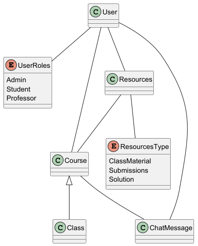

# Phase 1 – Analysis / Requirements & Design

---

## Project description

TO-DO: Project description text

## Analysis / Requirements

### Functional and Non-functional Requirements

#### Functional Requirements

- Login/Logout (email para avisar que foi feito login, com dia e hora)
- Download files -> (para permitir que o utilizador tenha input do utilizador na criação de pastas) precisa de ser refinado porque pode não ter as ideias supsotas
- Upload class material files (Teacher) -> Verificação do conteudo enviado (proibir ficheiros de tipos especificos)
- Chat message/Forum -> Proibir spam, revisão de mensagens
- Students Submissions -> Verificação do conteudo enviado (proibir ficheiros de tipos especificos)
- Teacher gives feedback to student's submissions and grandes them -> Não permitir alunos alterar as notas
-

#### Non-Functional Requirements

-
-
-
-
-

### Secure Development Requirements

-
-
-
-
-

### Abuse Cases

- Brute force Login
- Upload malicious files
- Unhathorized acess to a file without the correct permissions
- Privilege escalation
- Chat abuse (spam injection)

---

## Design

### General Design

-
-
-
-
-

#### Domain Model

### Threat Modeling

-
-
-
-
-

### Secure Design

-
-
-
-
-

### Secure Architecture

-
-
-
-
-

### Security Test Planning

-
-
-
-
-

---